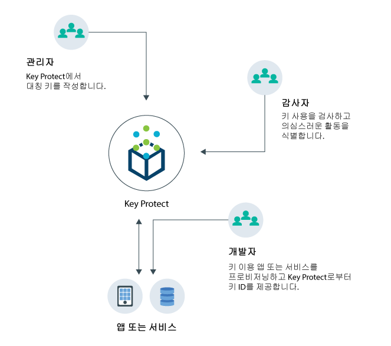
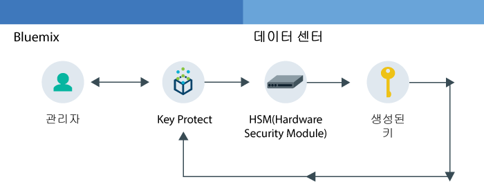
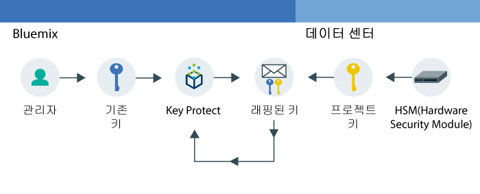

---

copyright:
  years: 2017
lastupdated: "2017-08-03"

---

{:shortdesc: .shortdesc}
{:codeblock: .codeblock}
{:screen: .screen}
{:new_window: target="_blank"}
{:pre: .pre}
{:tip: .tip}

# {{site.data.keyword.keymanagementserviceshort}} 정보

{{site.data.keyword.keymanagementservicelong}}를 사용하여 다양한 시나리오에서 키를 관리할 수 있습니다.
{: shortdesc}

## {{site.data.keyword.keymanagementserviceshort}} 사용에 대한 이유
{: #kp_reasons}

다음 시나리오에서 키를 관리하려고 할 수 있습니다.

<table>
  <tr>
    <th>시나리오</th>
    <th>이유</th>
  </tr>
  <tr>
    <td>개별 리소스별로 의료 기록과 같은 민감한 데이터를 대량으로 암호화해야 합니다. </td>
    <td>{{site.data.keyword.keymanagementserviceshort}} 서비스를 [{{site.data.keyword.objectstorageshort}} ](https://console.bluemix.net/docs/services/ObjectStorage/index.html ) 등의 스토리지 솔루션과 통합하여 클라우드에 보관된 데이터를 암호화할 수 있습니다. 서로 다른 키로 각 문서를 보호할 수 있으므로 데이터에 대한 세부 단위의 제어가 가능합니다. </td>
  </tr>
  <tr>
    <td>대기업의 IT 관리자로서, 다양한 서비스 오퍼링에 대해 키를 통합하고 추적하며 순환해야 합니다. </td>
    <td>{{site.data.keyword.keymanagementserviceshort}}
인터페이스는 여러 암호화 서비스의 관리를 간소화합니다. 이 서비스를 사용하면 하나의
중앙 집중식 위치에서 키를 관리하고 정렬할 수 있습니다. 또는 프로젝트별로 키를 분리하고 이를 서로 다른
{{site.data.keyword.Bluemix_short}} 영역에 보관할 수 있습니다. </td>
  </tr>
  <tr>
    <td>금융 또는 법률과 같은 업계의 보안 관리자로 데이터 보호 방법에 대해 거버넌스를 준수해야 합니다. 보안을 유지하려는 데이터를 취약하게 만들지 않으면서 제어되는 키 액세스를 부여해야 합니다. </td>
    <td>이 서비스를 사용하면 [서로 다른 {{site.data.keyword.Bluemix_notm}} 역할을 지정](managing-keys.html#viewkeyassignments)하여 키를 관리하기 위한 사용자 액세스 권한을 제어할 수 있습니다. 예를 들어, 키 자료를 보지 않은 채 키 작성 정보를 봐야 하는 사용자에게 읽기 전용 액세스 권한을 부여할 수 있습니다. </td>
  <tr>
    <td>개발자로서 셀프 암호화 스토리지와 같은 기존의 애플리케이션을 {{site.data.keyword.keymanagementserviceshort}}에 통합할 수 있습니다. 서비스와 통합된 고유 앱도 개발할 수 있습니다.</td>
    <td>{{site.data.keyword.Bluemix_notm}}의 앱이나 외부 앱을 {{site.data.keyword.keymanagementserviceshort}} API와 통합할 수 있습니다. 사용자의 앱을 위한 기존의 자체 키를 사용할 수 있습니다. </td>
  </tr>
  <tr>
    <td>개발 팀에게 엄격한 정책이 적용되어 14일마다 키를 생성하고 순환하는 방법이 필요합니다. </td>
    <td>{{site.data.keyword.Bluemix_notm}}를 사용하면 HSM(Hardware Security Module)에서 신속하게 키를 생성하여 지속적인 보안 요구사항을 충족시킬 수 있습니다. </td>
  </tr>
</table>

## {{site.data.keyword.keymanagementserviceshort}}의 작동 방식
{: #kp_how}

{{site.data.keyword.keymanagementservicelong_notm}}는
{{site.data.keyword.Bluemix_notm}} 역할에 따라 조직 전체에서 암호화 키를 관리하는 데 도움을 줍니다.

감사자에게 필요하지 않은 고급 권한이
IT 또는 보안 관리자에게는 필요할 수 있습니다. 액세스를 간소화하기 위해 {{site.data.keyword.keymanagementserviceshort}}는
각 역할에서 다른 서비스 보기를 가질 수 있도록 {{site.data.keyword.Bluemix_notm}} 역할을 맵핑합니다.
사용자의 요구사항에 적합한 액세스 레벨 및 보기에 대한 안내를 받으려면 [키 및 액세스 감사](managing-keys.html#viewkeyassignments)를 참조하십시오.

다음 다이어그램은 관리자, 감사자 및 개발자가 서비스에서 관리되는 키와 상호 작용할 수 있는 방법을 표시합니다.

<dl>
  <dt>서비스 통합</dt>
    <dd>{{site.data.keyword.Bluemix_notm}} 영역 관리자는
암호화에 대한 키를 관리합니다. </dd>
  <dt>감사</dt>
    <dd>감사자는 키 사용을 검사하고 의심스러운 활동을 식별합니다. </dd>
  <dt>앱</dt>
    <dd>개발자는 앱으로 코딩한 암호화에 대한 키를 관리합니다. </dd>
</dl>

## {{site.data.keyword.keymanagementserviceshort}}
아키텍처
{: #kp_architecture}

{{site.data.keyword.keymanagementservicelong_notm}}는 업계에서 채택한 기술로 구성되어 있습니다.

<dl>
  <dt>{{site.data.keyword.Bluemix_notm}} 서버</dt>
    <dd>{{site.data.keyword.Bluemix_notm}} 서버의 ID, 프로젝트 및 해당 토큰을 통해 {{site.data.keyword.keymanagementserviceshort}} 서비스에서 리소스와 키를
맵핑할 수 있습니다.</dd>
  <dt>{{site.data.keyword.keymanagementserviceshort}}용 API</dt>
    <dd>{{site.data.keyword.keymanagementserviceshort}} REST API는
키 작성 및 관리를 구동합니다. 이 서비스는 암호화된 멀티 테넌시를 제공합니다.</dd>
  <dt>{{site.data.keyword.Bluemix_notm}}의 사용자 인터페이스</dt>
    <dd>{{site.data.keyword.keymanagementserviceshort}} 사용자
인터페이스(UI)를 사용하여 키에 대해 안전하게 작업할 수 있습니다.</dd>
  <dt>HSM(Hardware Security Module)</dt>
    <dd>한편 {{site.data.keyword.IBM_notm}} 데이터 센터는 키를 보호하기 위한 하드웨어를 제공합니다. </dd>
  <dt>데이터베이스 클러스터</dt>
    <dd>클러스터된 데이터베이스에서 키의 중복 및 보안 스토리지에 대해 신뢰할 수 있습니다. </dd>
</dl>

다음 다이어그램은 서비스가 키를 저장하는 방식과 비교하여,
{{site.data.keyword.keymanagementserviceshort}}가
HSM(Hardware Security Module)과 함께 작동하여 어떻게 키를 생성하는지 표시합니다.

